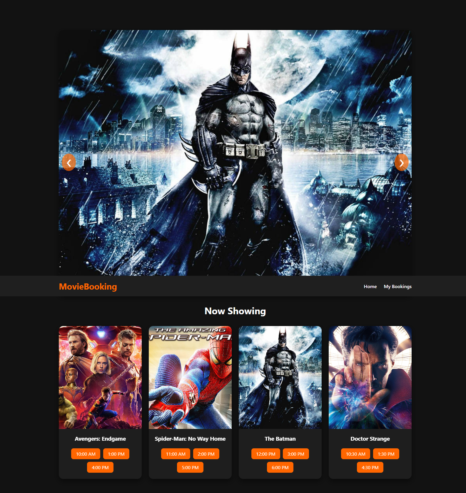

# Movie Booking Website

A modern static movie booking website where users can:

- Browse movies and showtimes
- Select a movie and showtime
- Select seats dynamically
- View booking summary with total price
- Persistent selection using localStorage
- Responsive design for all devices

## Features

- Dynamic seat selection with real-time updates
- Multiple showtimes per movie
- Booking summary page
- Fully responsive layout
- LocalStorage to save bookings

## Tech Stack

- HTML
- CSS
- JavaScript
- LocalStorage for persistence
- 
## 📸 Screenshots


## How to Use

1. Clone the repository:
   ```bash
   git clone https://github.com/ramesh-852000/movie-booking-website.git
